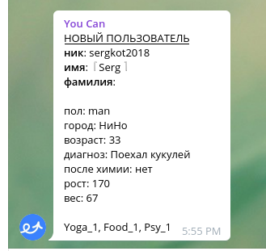
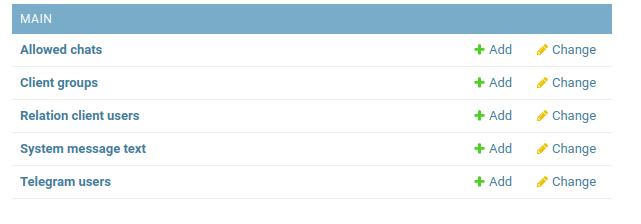
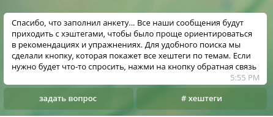
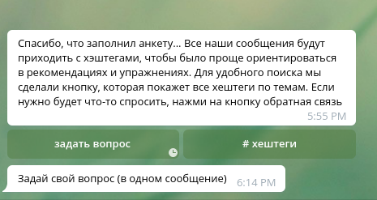
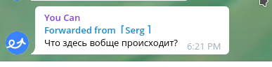
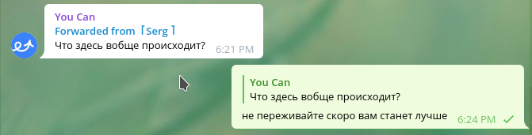
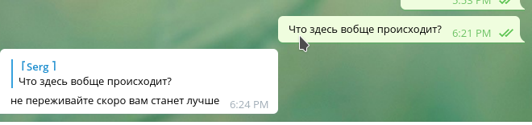
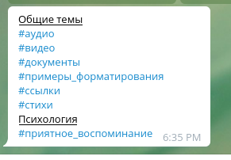
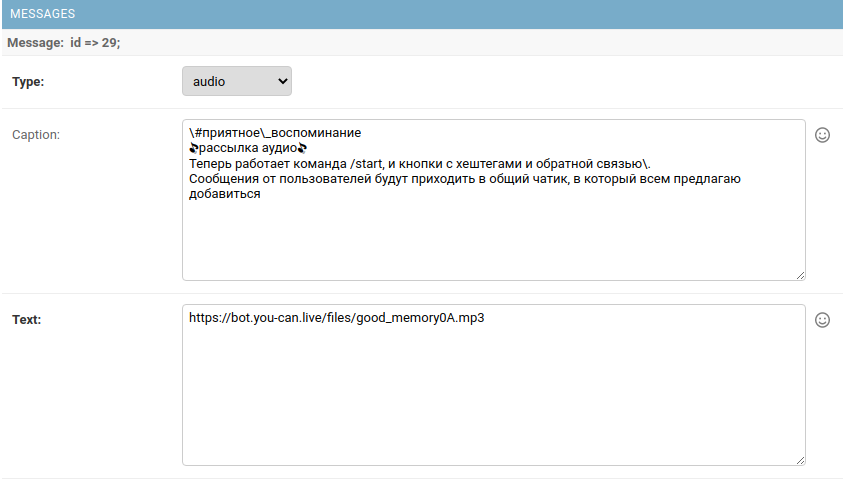

# Общая информация
Бот представляет из себя серверное приложение, расположенное на сервере Google,
где то в Швейцарии. 
Бот написан на языке программирования Python, с использованием фреймворка Django.
Панель администрирования доступна по адресу: https://example.com/  

Для начала работы ботом в него надо добавиться, сделать это можно несколькими способами:  
 - Найти его в поиске в телеграмме 
 - кликнуть по ссылке http://t.me/you_bot_link  на телефоне или компьютере, 
 и если прложение Telegram установлено
 то оно должно открыться уже в чате.
 Ссылку так-же можно защить в QR код, или повесить на кнопку на сайте,
 тогда чат будет открываться при сканирование QR- кода или при нажатие кнопки.
  
 ## Опросник
 При открытие чата будет доступна кнопка /start, при нажатие на которую запустится
 сценарий опросника. Опросник надо пройти польностью, только при ответе на все вопросы будет пользователь
 будет распределен во все группы (питания, йога, психология), и у пользователя в базе данных
 будет проставлен флажок что профиль заполнен, анкета собрана, после которого он сможет получать рассылки 
 с контентом. 
 
 **Пользователи, которые не до конца прошли опросник получать рассылки _не будут_.**
 
 При прохождении анкеты, вопросы на которые пользователь уже ответил удаляются из ленты.
 Это сделано во первых для красоты, во вторых чтобы избежать повторного нажатия на кнопки. 
 К сожалению нельзя удалять сообщения у пользователей, которые были отправлены более чем 48 часов назад.
 Т.е. у пользователя который не до конца ответил на вопросы, и спустя более чем два дня вернулся к
 заполнению анкеты, не удалится из ленты последнее сообщение, на котором он остановился в прошлый раз.
 Клики на кнопки в этом старом сообщение будут проигнорированы ботом. 
 
 Когда пользователь ответит на все вопросы, информация о новом пользователе придет
 в общий чат **uCan - чат**.  
 
   
 
 Вся информация собранная с пользователя, записывается базу данных. 
 Посмотреть её можно в админке. 
 Поля в админке не закрыты от редактирование, поэтому **лучше ничего не удалять**.  
 В разделе **MAIN** в таблице **Telegram users**  
 
   
 
 Ответы на вопросы хранятся в разделе **Analytics**, таблица **Anketa**.  
 
   
 
 так же в конце опросника пользователь получит информационное сообщение
 с кнопками.  
 
   
 
 Повторно это сообщение можно вызвать написав команду **/start**
 
 ## Задать вопрос
 
 При нажатие на кнопку **задать вопрос**, пользователю придет сообщение с просьбой написать
 свой вопрос и запустится сценарий ожидание сообщения от пользователя.  
 
   
 
 Сообщение написанное пользователем уйдет в служебный чат, туда же куда 
 присылается информация о новых пользователях.  
 
   
 
 Для ответа надо нажать **replay** на это сообщение, и ответ уйдет пользователю.  
 
   
 
 У пользователя ответ, будет выглядеть так  
 
   
 
## Хештеги

При нажатие на кнопку с хештегами, пользователю придет сообщение с
хештегами всех рассылок, которые получал пользователь.  

  

**ВАЖНО**  
При создание рассылки есть требования:  
- Хештег должен всегда идти в начале сообщения, на **первой строке**  
- Хештег надо экранировать, как и остальные спец. символы (точки, тире и.т.д.)  
- Хештег должен содержать только русские буквы (так получилось, можно доработать при необходимости)  
- Хештег может быть составным, через нижнее подчеркивание  

  

При отправке сообщения пользователю оно проверяется и если в нём находится хештег,
то этот хештег добавляется пользователю. Хештеги группируются в зависимости от того 
какой группе было отправлено сообщение, т.е. если рассылка была группе психология, 
то создастся хештег в группе психология. Если Рассылка была отправлено пользователю, 
а не группе, или если было выбранно несколько групп для отправки, 
то такому хештегу присвоится **Общие темы**

 
 