# Инструкция по рассылке
Первое что нам нужно, это добавится в чат к боту. Бот тестовый, и поменяется чуть позже.  
ссылка для доступа в чат  

http://t.me/you_bot_link

Далее нажать /start.

После нажатия, бот добавит в базу данных нового пользователя. 
И пользователю можно будет отправлять рассылки и взаимодействовать с ним.

У нащего бота есть админ-панель, через которую и надо рассылать контент
доступ к ней:  
https://127.0.0.1/

Пользователь с правами  
**admin**  
**admin**

Всех пользователей бота можно посмотреть в разделе **MAIN** -> **Clients**  

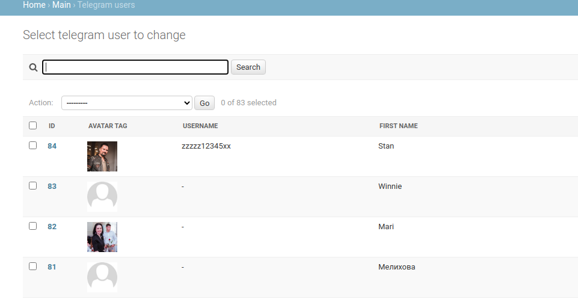  

##Раздел с рассылками
Рассылка создается в разделе **SENDER**  в таблице **Content messages**  
Провалившись в раздел можно посмотреть на все рассылки  

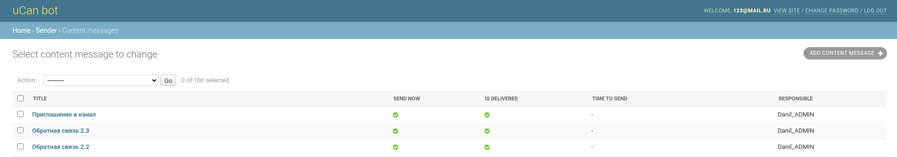

Рассылки, можно отправлять повторно и редактировать.  
Для создания новой рассылки надо нажать на  
**ADD CONTENT MESSAGE**

## Создание новой рассылки
###Верхний блок  

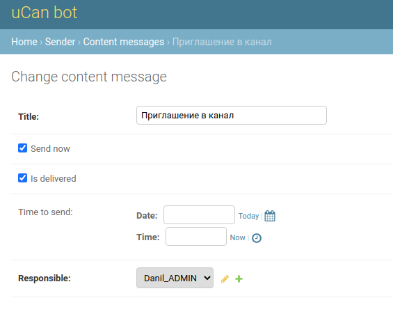   

- **Title** Название для рассылки, особо ни на что не влият, нужно для того чтобы
отличать одну рассылку от другой
- **Send now** Чек-бокс, если нажать, то сразу после сохранения рассылки
она будет отправлено всем пользователям указанным ниже..
- **Is deliverd** Чек-бокс говорящий о том (если стоит галочка), что рассылка уже была отправлена
Если ее убрать, и например проставить время отправки, или **Send now**, 
то такая рассылка будет отправлена повторно
- **Time to send** Дата и время, нужно указывать для отложенной отправки. 
При наступление этого времени будет запущена рассылка.
- **Responsible** Ответственный сотрудник за рассылку. У него так же должна быть
проставлена связка с пользователем телеграмма в разеде **MAIN** -> **Relation client users**
Эта связка нужна для того чтобы ответственному за рассылку в телеграм пришел отчёт о рассылке.  

###Раздел с сообщениями  

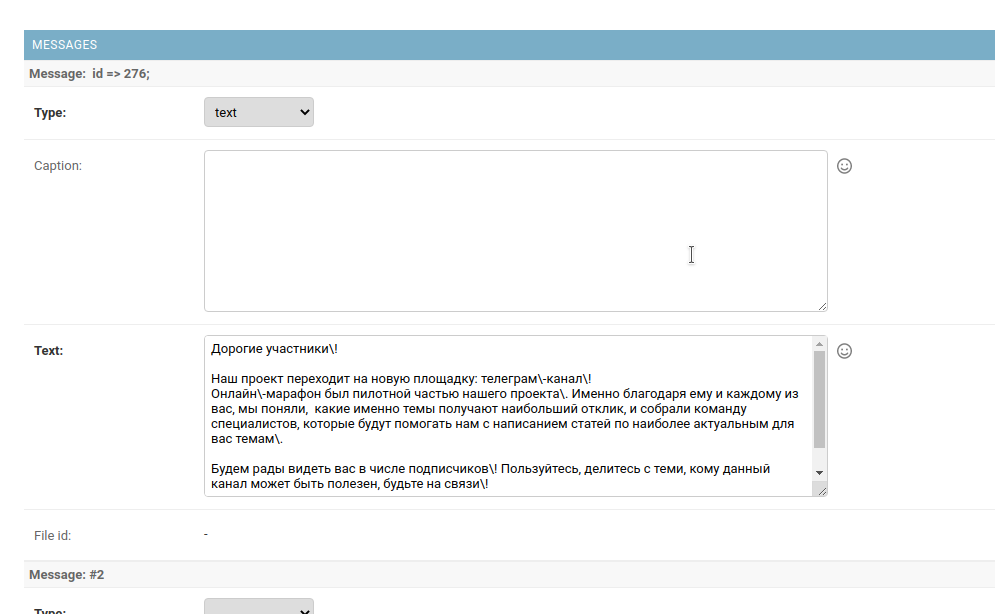

###Tипы сообщений. 
Важно правильно выбирать тип отправляемого сообщения.
Разные типы сообщения отправляются по разному. 
В телеграме доступны следующие типы сообщений(текст, фото, аудио, видео, документы,
стикеры, геолокации, набор фоток, стикеры, голосовые, опросы).
На данном этапе в боте реализована возможность отправлять указанные выше типы сооющений.
Если нужно будет добавить новые типы сообщений, добавим
- **text** обычные текстовые сообщения. Выбрав этот тип нужно будет вставить текст 
сообщения в поле **text**. Поле **caption** для данного типа сообщений нужно оставлять пустым.
При создание сообщения перенос текста на следующую строку также распознается телеграммом.
Например такое сообщение  

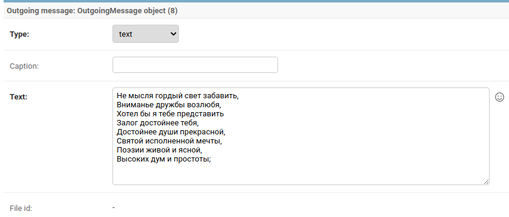

В телеграмм придет с таким же переносом текста  

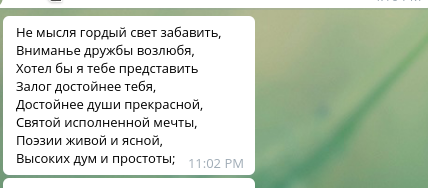  

ВАЖНО: Для форматирования текста сообщений (выделение, курсив) используются дополнительные символы.
Кроме того, для того чтобы эти спциальные символы включить в текст сообщений их нужно
экранировать.

Все возможности форматирования  

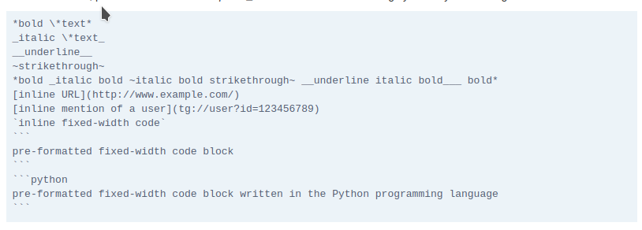

Телеграм конвертирует это в такой вид  

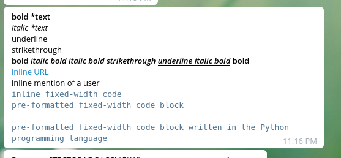  

Из примера выше понятно, что выделение текста получается так \*выделенный текст*.  
А если нам нужно звездочку добавить в тект то её экранируем с помощью \.  
Есть много символов которые надо экранировать, это осложняет написание текста. 
Текст лучше готовить в текстовом редакторе, и вставлять уже готовый. 
Вот все символы которые нужно экранировать косой чертой "\"

```python
'_', '*', '[', ']', '(', ')', '~', '`', '>', '#', '+', '-', '=', '|', '{', '}', '.', '!' 
```  
В текст так же можно вставлять ссылки и emoji.  
Ссылки можно всавлять двумя способами. Первый способ это просто копирование ссылки как есть.
Это правда приведет к тому что в сообщение прогрузится кусочек страницы.  
Например:  

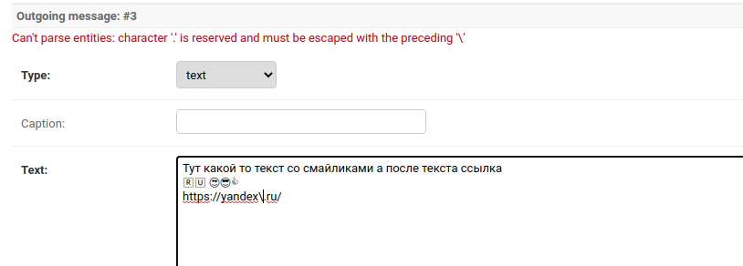  

Тут видно также сообщение об ошибке. В URL адресе есть точка, а её тоже надо экранировать.
(это если мы ссылку отправляем внутри текстового сообщщения).  

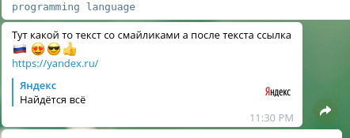

Второй способ, это спрятать ссылку в текст как на примере выше.
```python
[этот текст будет синим цветом как ссылка](http://www.example.com/)  

```
Тут мы как бы прячем ссылку за текст.
Да в документации указано про ограничение в 4000 знаков на сообщение. 
Я скопировал несколько глав Евгения Онегина, там было 2500 знаков, и оно ушло 
5-ю сообщениями. То есть телеграмм сам разбивает длинные сообщение на части. 
Эти части потом можно пересылать как самостоятельные сообщения.  

- **photo** фото, отправляется как ссылка. К фотки так же можно добавить описание в раздел
**caption**. Само описание также поддерживает спциальные символы, для выделения. 
И в описание так же надо экранировать точки и остальные символы.
Чтобы добавить фотку(а так же видео, аудио, документы), ее надо загрузить на наш сервер. 
Загрузить можно в разделе:  

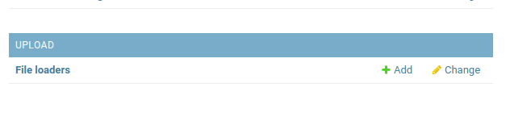  

После загрузки появится ссылка на файл, эту ссылку и надо прикрепить в сообщение.
Моно нажать на ссылку кстати, и файл откроется  в отдельной странице браузера.   
 
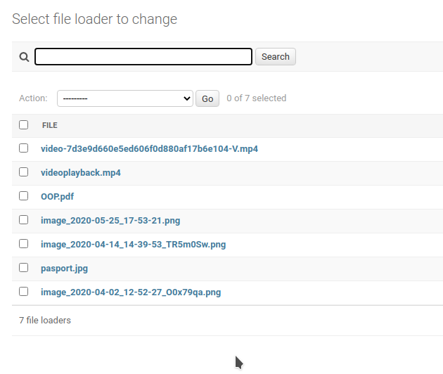  

Наверно стоит давать какие то понятные название файлам. и также НИКОГДА 
НЕ ИСПОЛЬЗОВАТЬ В НАЗВАНИЕ ФАЙЛОВ русские буквы.  
Важно так же не оставлять пробелов после ссылок и переносов на другую строку.  
Их не видно, но на самом деле это тоже добавляет символов, которые могут привести к ошибкам.

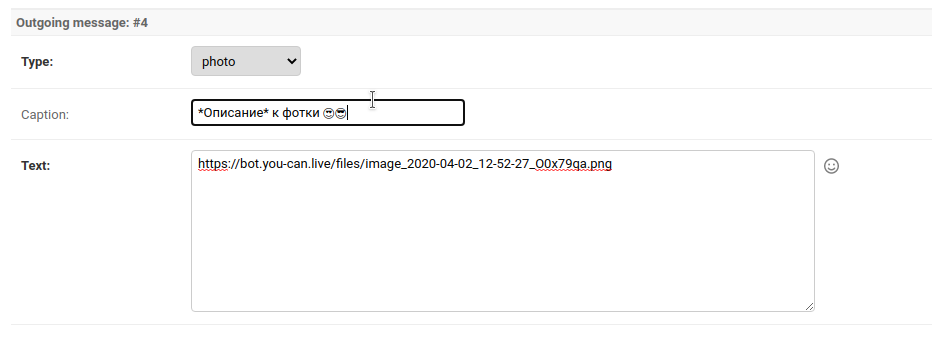  

В телеграмме:  

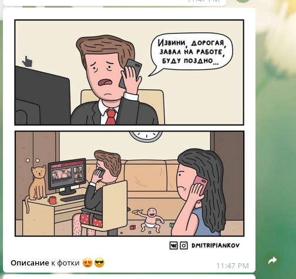  

- **video** Формат mp4. В таком формате например записывает видео мой андройд.  
Ограничение по размеру 50 мегабайт. Такое же ограничение действует и на остальные файлы. 
- **document** Например PDF файлы. 
- **audio** mp3   

Отправка этих трех типов сообщений ничем не отличается от отправки фото.  
Загружается файл на сервер, копируется ссылка. и отправляется.  

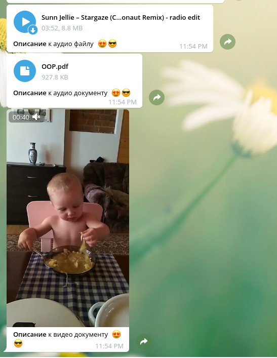  

- **media_group** отправка набора фоток. 
В текстовое поле можно вставить ссылки друг за другом и они склеются телеграммом в один  набор.  

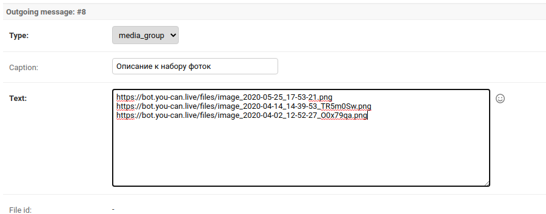  

В телеграмме:  

  

Если файл например видео на телефоне, то достаточно удобно загрузить его прям с телефона.  

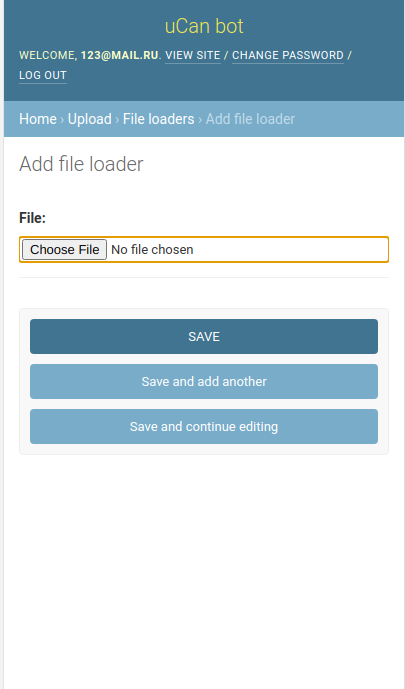  

### Отправка рассылки

Рассылка может соостоять из неограниченного кол-ва сообщений разных типов. Для подготовки этой инструкции
я создал 9 сообщений рахных типов. Если мы хотим отправить рассылку сейчас. Ставим галочку 
**Send now** и нажимаем кнопку **Save**. После сохранения, рассылка сразу же отправится. 
Для повторной отправки. Нужно зайти в рассылку, убрать галочку **is_delivered** и сохранить еще раз.  

Также надо выбрать пользователей, кому отправлять рассылку.  

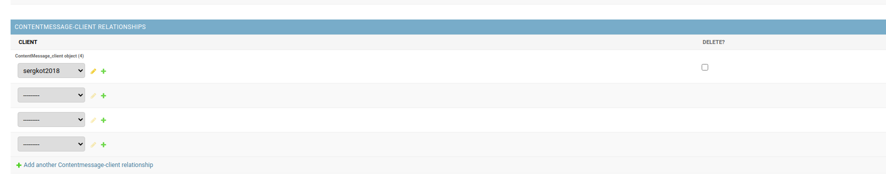  

Там ниже есть раздел с группами, но он пока не работает, это заглушка.   

После отправки рассылки, ответственному пользователю придет отчет. Если в ходе рассылки будут ошибки, 
то информация об ошибках также придет в телеграмм.  

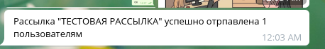  


