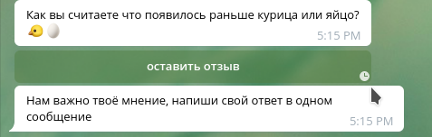

# Инструкция по сбору развёрнутых ответов от пользователя

## Форма рассылки (раздел Detalied answer)
  

Форма полностью совпадает с рассылкой контета и разделом **Content messages**.
Для этой формы есть одно правило **в рассылке можеть быть только одно сообщение**  

Пример рассылки  

  

При отправке рассылки к сообщению добавляется кнопка  

  

При нажатие на кнопку активируется режим ожидания ответа от пользователя.
И пользователю приходит сообщение с просьбой написать свой отзыв  

  

После ответа служебное сообщение удаляется, а ответ пользователя записывается 
в таблицу с отчетом.  

  

Отчет с ответами пользователя можно посмотреть в разделе **Report with detailed**  

  

  

